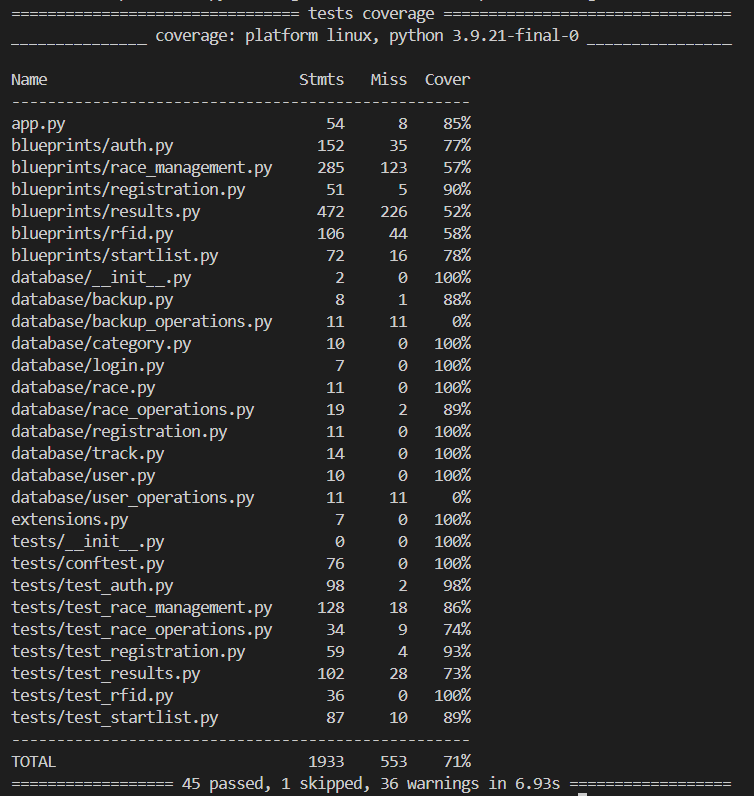
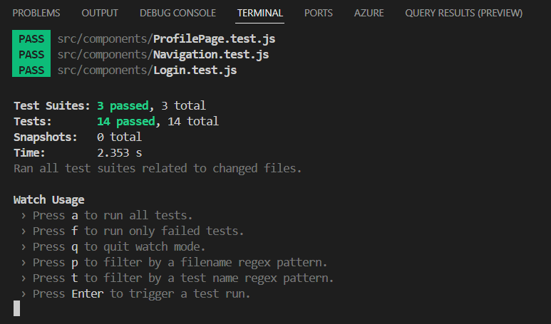

# CheckPoint - RFID Sports Timing System

<p align="center">
  
  <br>
  <em>Reliable, affordable timing solution for sporting events</em>
</p>

## 📋 Overview

CheckPoint is a comprehensive web-based RFID timing system designed for sporting events, developed as a bachelor's thesis at the Technical University of Liberec. The system offers a complete solution for race organizers and participants, combining easy-to-use interfaces with powerful timing functionality.

## 📚 User Manual

**A complete user guide is available in [docs/technicka_dokumentace.pdf](docs/technicka_dokumentace.pdf)**

This document provides detailed instructions on:
- Setting up the system for your event
- Creating and configuring races
- Managing participant registrations
- Using the RFID reader integration
- Processing results and generating reports
- Troubleshooting common issues

We highly recommend reviewing the user manual before deploying the system for your event.

## ✨ Key Features

- **🏁 Race Management** - Create, edit, and manage races with custom tracks and categories
- **📡 RFID Integration** - Connect with RFID readers for automatic participant tracking
- **👥 User Registration** - Simple registration process for participants
- **⏱️ Real-time Results** - Live timing and results calculation
- **🌐 Multilingual** - Full support for Czech and English languages
- **📱 Responsive Design** - Works seamlessly on desktop and mobile devices
- **🔧 Customizable** - Configurable for various event types and competition formats

## 🏗️ System Architecture

Built with a modern technology stack:

| Component | Technology |
|-----------|------------|
| Frontend  | React.js   |
| Backend   | Python Flask |
| Database  | PostgreSQL |
| Deployment| Docker + Nginx |

## 🚀 Installation

### Prerequisites

- Docker and Docker Compose
- Git

### Development Environment

```bash
# Clone the repository
git clone https://github.com/yourusername/checkpoint.git
cd checkpoint

# Start the development environment
docker-compose up -d

# Access the applications:
# - Frontend: http://localhost:3000
# - Backend API: http://localhost:5001
# - Database Admin: http://localhost:8080
```

### Production Environment

```bash
# Deploy with production configuration
docker-compose -f docker-compose.prod.yml up -d
```

## 🧪 Testing

The project includes comprehensive test coverage for both frontend and backend components.

### Backend Tests

<p align="center">
  
</p>

```bash
cd backend
pytest
```

### Frontend Tests

<p align="center">
  
</p>

```bash
cd frontend
npm test
```

## 📁 Project Structure

```
checkpoint/
├── backend/
│   ├── app.py              # Main application entry point
│   ├── blueprints/         # API endpoints by feature
│   │   ├── auth.py         # Authentication services
│   │   ├── registration.py # Race registration
│   │   ├── results.py      # Results processing
│   │   └── rfid.py         # RFID reader integration
│   └── database/           # Data models
├── frontend/
│   ├── public/             # Static assets
│   └── src/
│       ├── components/     # React components
│       ├── contexts/       # Context providers
│       └── styles/         # CSS styling
└── docker-compose.yml      # Docker configuration
```

## 👥 User Roles

The system supports two primary user roles:

1. **Organizers** - Full system access including race creation, RFID management, and results editing
2. **Participants** - Registration access and results viewing capabilities

## 📝 License

This project is licensed under the MIT License - see the LICENSE file for details.


## 📞 Contact

Jan Schejbal - jan.schejbal@tul.cz

Project Repository: [https://github.com/Sch3jby/checkpoint](https://github.com/Sch3jby/checkpoint)
